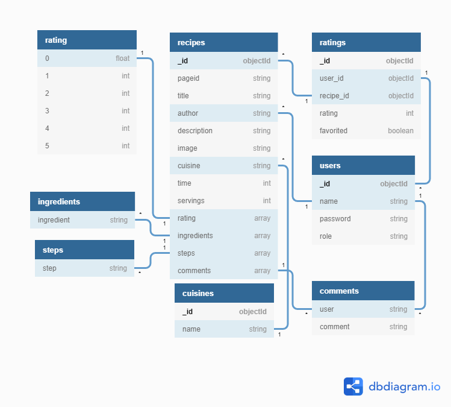

# Plum

Plum is a recipe sharing website designed to help users find recipes and share their own with others.

[See live site.](https://plum-recipes.herokuapp.com/)

## Table of Contents

- **[User Experience](#User-Experience)**
  - [Project Goals](#Project-Goals)
    - [User Stories](#User-Stories)
- **[Design](#Design)**
  - [Database](#Database)
    - [Indexes](#Indexes)
    - [Queries](#Queries)
      - [Browsing](#Browsing)
      - [Users](#Users)
      - [Searching](#Searching)
      - [Uploading](#Uploading)
      - [Administration](#Administration)
  - [Fonts](#Fonts)
  - [Colours](#Colours)
  - [Layout](#Layout)
- **[Features](#Features)**
  - [Existing Features](#Existing-Features)
  - [Future Features](Future-Features)
- **[Technologies](#Technologies)**
  - [Site architecture](#Site-architecture)
  - [Languages](#Languages)
  - [Libraries](#Libraries)
  - [Editors](#Editors)
  - [Tools](#Tools)
  - [Platforms](#Platforms)
- **[Testing](#Testing)**
- **[Source Control](#Source-Control)**
  - [Branches](#Branches)
  - [Github Desktop](#Github-Desktop)
- **[Deployment](#Deployment)**
  - [Database Deployment](#Database-Deployment)
  - [Deployment Platform](#Deployment-Platform)
- **[Credits](#Credits)**
  - [Media](#Media)
  - [Acknowledgements](#Acknowledgements)

## User Experience

### Project Goals

The project goal is to produce a recipe sharing website that allows users to share recipes.

### User Stories

**Browsing**

- (US001) - As a cook I want the website to make suggestions to me so I can be introduced to new content.
- (US002) - As a cook I want to see reviews and ratings from other users so I can select the best content.

**Searching**

- (US003) - As a cook I want to search recipes by name so that I can find specific dishes that I want to make.
- (US004) - As a cook I want to search recipes on cuisine type so that I can get dishes of a specific type I want to make.
- (US005) - As a cook I want to be able to be able to filter recipes based on cooking time so I can get dishes I have time to prepare.
- (US006) - As a cook I want to save my favourite recipes so that I can quickly find them again in the future.

**Uploading**

- (US007) - As a recipe creator I want to upload my own recipes so that other users can benefit from them.
- (US008) - As a recipe creator I want to gain feedback on my recipes so I can discover improvements.
- (US009) - As a recipe creator I want to be able to edit a recipe I've posted so I can improve it.

**Users**

- (US010) - As a new user I want to be able to register with the site so that I can upload new recipes and track my favourites.
- (US011) - As a registered user I want to be able to log into my account so that I can access my recipes and favourites.

**Administration**

- (US012) - As an admin I want to be able to edit content to ensure it adheres to site rules.
- (US013) - As an admin I want to be able to add cuisine categories so users can search efficiently.

**General**

- (US014) - As a user I want to receive clear feedback for my actions so I know if any further action is required.

##  Design

### Database 

#### 

[(PDF)](dev/mockups/plum_erd.pdf)

#### Indexes

**recipes:**

1. Unique index on page_id - Ensures pageid field is unique.

   ```Mongodb
   plumdb.recipes.createIndex(
   {
   	pageid : 1
   },
   {
   	unique: true
   })
   ```

2. Text index on title and description for text searches.

   ```Mongodb
   plumdb.recipes.createIndex(
   {
   	title : "text",
   	description : "text"
   })
   ```

**users:**

1. Unique index on name - Ensures two users can't share a username.

   ```Mongodb
   plumdb.users.createIndex(
   {
   	name : 1
   },
   {
   	unqiue: true
   })
   ```

**ratings:**

1. Unique compound index on user_id and recipe_id - Ensures only one interaction record between one recipe and user.

   ```Mongodb
   plumdb.ratings.createIndex(
   {
   	recipe_id : 1,
   	user_id : 1
   },
   {
   	unique : true
   })
   ```

**cuisines:**

1. Unique index on name - Ensures each cuisine type only appears once.

   ```Mongodb
   plumdb.cuisines.createIndex(
   {
   	name : 1
   },
   {
   	unique : true
   })
   ```

#### Queries

##### Browsing

<details>
<summary><b>Find the 8 newest recipes (for US001):</b></summary>

```mongodb
plumdb.recipes.find().sort(_id, -1).limit(8)
```
</details>

<details>
<summary><b>Find a specific Recipe/User interaction (for US002, US008):</b></summary>

```Mongodb
plumdb.ratings.find_one({user_id : user['userid'], recipe_id : recipe['_id']})
```
</details>

##### Users

<details>
<summary><b>Find a specific user account based on username (US011):</b></summary>

```mongodb
plumdb.users.find_one({name: username})
```
</details>

<details>
<summary><b>Insert a new user account into the database (US010):</b></summary>

```mongodb
plumdb.users.insert_one(user-record)
```
</details>

<details>
<summary><b>Find all the recipes a user has uploaded:</b></summary>

```mongodb
plumdb.recipes.find({author : username})
```
</details>

<details>
<summary><b>Find all the recipes a user has favourited (for US006):</b></summary>

```mongodb
plumdb.ratings.aggregate([
	{ $match : {user_id : userid, favorited : True} },
	{
		$lookup : {
			from : recipes,
			localField : recipe_id,
			foreignField : _id,
			as : favorites
		}
	},
	{$unwind : $favorites},
	{$replaceRoot : {newRoot : $favorites}}
])
```
</details>

##### Searching

<details>
<summary><b>Find a single recipe from it's pageid (for showing a single recipe page):</b></summary>

```Mongodb
plumdb.recipes.find_one({pageid: pageid})
```
</details>

<details>
<summary><b>Find recipes conforming to a user's search (for US003, US004, and US005):</b></summary>

Any individual field can be omitted as long as at least one field is passed.

```Mongodb
plumdb.recipes.find({
	cuisine* : query.cuisine,
	servings* : query.servings,
	time* : {$lte : query.time},
	rating* : {$gte : query.time},
	$text* : {
		$search : query.text,
		$caseSensitive : False
	}
})
```

*Optional
</details>

##### Uploading

<details>
<summary><b>Add a rating vote to a recipe (for US002 and US008):</b></summary>

Updating the recipe record

```mongodb
plumdb.recipes.update_one({_id : recipeId}
{
	$set : {
		rating.0 : avg_rating,
		rating.<vote> : rating[vote] + 1
	}
})
```

Adding the rating record

```mongodb
plumdb.ratings.insert_one(interaction-record)
```
</details>

<details>
<summary><b>Update a rating vote on a recipe (for US002 and US008):</b></summary>

Updating the recipe record

```mongodb
plumdb.recipes.update_one({_id : recipeId}
{
	$set : {
		rating.0 : avg_rating,
		rating.{vote} : rating[vote] + 1
		rating.{old_vote} : rating[old_vote] - 1
	}
})
```

Updating the rating record

```mongodb
plumdb.ratings.update_one({_id : interaction._id}, 
{
	$set : {rating : new_rating}
})
```
</details>

<details>
<summary><b>Favouriting a recipe (for US006):</b></summary>

```mongodb
plumdb.ratings.update_one({_id : existing_interaction._id},
	{$set : {favorited : favorite}})
```
</details>

<details>
<summary><b>Add a comment to a recipe (for US002 and US008):</b></summary>

```mongodb
plumdb.recipes.update_one({_id : recipeId}
{
	$push : { comments : {
		author : username,
		text : comment		
	}}
})
```
</details>

<details>
<summary><b>Add a new recipe (for US007):</b></summary>

```mongodb
plumdb.recipes.insert_one(recipe-record)
```
</details>

<details>
<summary><b>Edit an existing recipe (for US009 and US012):</b></summary>

```Mongodb
mongo.db.recipes.replace_one({pageid : pageid}, recipe-record)
```
</details>


##### Administration

TODO: Administration database queries here

### Fonts

Headers are rendered using [Open Sans](https://fonts.google.com/specimen/Open+Sans) with body text in [Roboto](https://fonts.google.com/specimen/Roboto). Open Sans was chosen for headers because it is bold and clear, while Roboto is easy to read and widely used on the web. Both are obtained from Google Fonts.

### Colours

Sap Green was chosen as it is associated with nature, health, and freshness. Plum purple fits the branding of the site well while also being complimentary to Sap Green and evoking feelings of luxury. Honeydew was chosen as a background colour as it is near white, providing plenty of contrast for darker elements and text, while also tying into the main green colour.

### 

- Sap Green (#3F7D20) - Main site brand colour
- Plum (#8E4585) - Accent colour
- Honeydew (#F3FCF0) - Background colour
- Rich Black (#0D0A0B) - Main text colour
- White - As a background to bring out some sections

### Layout

[Wireframes](dev/mockups/wireframes.pdf)

## Features

The site allows users to upload new recipes and edit their existing ones. Users can search for recipes based on name, description, cuisine type, number of servings cooking time and/or minimum rating. Users can favourite recipes, which links the recipe to their profile page. They can also comment on and rate recipes giving feedback to recipe creators.

### Existing Features

- (**US001**): On load the user is presented with the latest recipe uploads
- (**US002**): Ratings are shown on the front page and with search results
  - Recipe pages show a recipe's rating and comment list
- (**US003**): The basic search feature: 
  - Performs text searches on the name and description field
- (**US004, US005**): The advanced search feature:
  - Performs searches on the cuisines field
  - Performs searches on the servings field
  - Performs searches on the time field
  - Performs searches on the rating field
  - Performs searches on any combination of fields
- (**US006**): Recipes can be favourited with a heart icon on the recipe page
- (**US007**): Recipes can be added with the "add recipe" option on the main menu
- (**US008**): The site allows users to:
  - Comment on and rate recipes from the recipe page
  - Delete their own comments
- (**US009**): The site allows the recipe author to:
  - Edit the recipe from the recipe page
  - Delete the recipe from the recipe page
- (**US010**): New users can register on the site from the log on page
- (**US011**): Registered users can log in to the site from the log on page
- (**US012**): The site allows admin users to:
  - Edit any recipe from it's page
  - Delete any recipe from it's page
  - Delete any comment
- (**US014**): The site provides multiple feedback mechanisms:
  - Flash messages from the server provides information, warning and error messages raised during backend operations.
  - Forms indicate required fields with warning messages on submit.
  - Forms provide validation warnings through colour cues and messages on the form field.
  - Interactive site components react to user actions with hover cues.
  - Recipe ingredients can be "checked" to indicate usage or availability.
  - Recipe steps can be highlighted to indicate the user's current progress.

### Future Features

- (**US013**): There is currently no facility to add cuisine categories within the website.
- (**US012**): Admin panel to simplify administration tasks.
- User password can't be changed. Related to (**US010 and US011**).
- (**US007, US008, US009**): Rich text input for comments and recipe text.

## Technologies

### Site architecture

The site uses a python server backend and Mongodb database. Server code is implemented in the following files:

- app.py
  - Main server code. Flask initialisation, database interface, and server routes.
- decorators.py
  - Exposes custom decorators to simplify some defensive programming tasks.
- helpers.py
  - Exposes some simple functions for common tasks.

Front end HTML is generated by the following Jinja templates:

- base.html
  - Defines the main site structure and navigation. All other templates extend this.
- home.html
  - Generates the main landing page.
- login.html
  - Generates the login page. Performs user login and registration.
- search.html
  - Generates the search page. Performs searches and shows search results.
- recipe.html
  - Generate individual recipe pages.
- edit_recipe.html
  - Generates the add/edit recipe pages.
- user_profile.html
  - Generates the user profile pages.

In addition the following templates provide macros for generating custom controls and display elements:

- items.html
  - Exposes macros that generate:
    - The recipe cards used on the landing page
    - The icon tiles used for recipe links on search and user profile pages
- star-rating.html
  - Exposes macros that generate:
    - The static star rating display element
    - The interactive star rating control

Pages are styled through the following css files:

- style.css
  - Defines global styles used by all pages.
- login.css
  - Defines styles used by the login page.
- recipe.css
  - Defines styles used by the recipe and add/edit recipe pages
- search.css
  - Defines styles used by the search page

The site also uses the following JavaScript files for dynamic functionality:

- script.js
  - Code used by all pages.
    - Initialises materialize components.
    - Defines a general AJAX function.
- login.js
  - Code used on the login page.
    - Performs AJAX requests to check username is available during registration
    - Ensures password and password confirmation fields are equal.
- recipes.js
  - Code used on the recipe and add/edit recipes pages.
    - Performs AJAX submissions for commenting, rating and favouriting recipes.
    - Interfaces with cloudinary for image uploads.

### Languages

- [HTML5](https://developer.mozilla.org/en-US/docs/Web/Guide/HTML/HTML5)
  - Used as the markup language for the site layout.
- [CSS3](https://developer.mozilla.org/en-US/docs/Web/CSS)
  - Used to style and colour HTML and dynamic elements.
- [JavaScript](https://developer.mozilla.org/en-US/docs/Web/JavaScript)
  - Used to create and manipulate the site's client-side dynamic elements. Also performs AJAX requests for client/server communication.
- [Python](https://www.python.org/)
  - Used for the backend server and running queries to the database.
- [Jinja](https://jinja.palletsprojects.com/en/2.11.x/)
  - Used to generate HTML from site templates
- [SVG](https://developer.mozilla.org/en-US/docs/Glossary/SVG)
  - Used to define a number of the sites icons and graphical elements.

### Libraries

- [Flask](https://flask.palletsprojects.com/en/1.1.x/)
    - The project uses the Flask micro-web framework to simplify web server tasks.
- [Wekzeug](https://palletsprojects.com/p/werkzeug/)
    - The project uses the Werkzeug WSGI library to manage the Web Server Gateway Interface and related tasks.
- [JQuery](https://jquery.com)
    - The project uses JQuery to simplify DOM manipulation.
- [Materialize](https://materializecss.com/)
    - The project uses Materialize to aid in responsive design and conforming to the google material design language.

### Editors

- [Typora](https://typora.io/)
  - Typora was used to simplify creation of the README.md file.
- [Atom](https://atom.io/)
  - Atom was used to write HTML/CSS, Javascript and Python code.
- [dbdiagram](https://dbdiagram.io/home)
  - Used to create Entity Relationship Diagrams of the database.
- [Balsamic](https://balsamiq.com/)
  - Used to create the website's wireframes.

### Tools

- [Git](https://git-scm.com/)
  - Used for version control (via github desktop).
- [Github desktop](https://desktop.github.com/)
  - Used to push updates and synchronise local code with the remote repository.
- [Github](https://github.com/)
  - Used to store the project repository and deploy the site via github pages.
- [MongoDB](https://www.mongodb.com/3)
  - Used for the backend database.
- [Adobe Photoshop](https://www.adobe.com/products/photoshop.html)
  - Used to create some of the image files used on the site.
- [Adobe Illustrator](https://www.adobe.com/products/illustrator.html)
  - Used to create some of the sprite images and icons used on the site.
- [Cloudinary](https://cloudinary.com/)
  - Used to store and serve recipe images and handle image uploading.
- [Coolors](https://coolors.co/)
  - Used to help define the site colour scheme.

### Platforms

- [Heroku](https://www.heroku.com/platform)
  - The project uses Heroku as it's deployment platform.

## Testing

Information on testing can be found in [TESTING.md](TESTING.md)

## Source Control

The website was developed using the Atom editor with github for version control. Github Desktop was used to simplify the process of compiling pushing commits to the remote repository.

### Branches

Branches were used to add and develop new features for testing without affecting the main branch and deployed application. 

#### Creating a branch

<details>
<summary>Command Line Interface:</summary>
`>git branch <branch name>`

A branch can be created and selected in one operation with:

`>git checkout -b <branch name>`

</details>

<details>
<summary>Github Repository:</summary>
From the repository main page on github.com:


1. Selecting the branch drop down

2. Typing a new branch name into the dropdown

3. Selecting the "Create Branch" option

   
   </details>

<details>
<summary>Github Desktop:</summary>
From github desktop main window:


1. Selecting the current branch drop down
2. Typing the new branch name into the input field
3. Clicking the new branch button


</details>

#### Selecting a branch

<details>
<summary>Command Line Interface</summary>

`git checkout <branch name>`
</details>

<details>
<summary>Github repository</summary>

From the githup repository main page:

1. Select the branch drop down
2. Select the required branch


</details>

<details>
<summary>Github Desktop</summary>

From the github desktop main window:

1. Select the current branch drop down
2. Select the required branch


</details>

#### Merging a branch

<details>
<summary>Command Line Interface</summary>

1. Checkout branch to merge into:

   `>git checkout <destination branch>`

2. Merge source branch into destination:

   `git merge <source branch>`
</details>

<details>
<summary>Github repository</summary>

From the github repository.

1. Select "Pull Requests" from the menu bar
2. Select button "Compare & pull request"
3. Select the destination branch from the first drop down
4. Select the source branch in the second drop down
5. Add any comments and select "Create pull request"
6. In the following page select "Merge pull request"
7. Add any comments and select "Confirm merge"


</details>

<details>
<summary>Github Desktop</summary>

From the github desktop main window:

1. Select the current branch dropdown
2. Select the required destination branch
3. Reopen the branch dropdown
4. Select "choose a branch to merge" option
5. From the new window select the required source branch
6. Select Merge button at the bottom of the window


</details>

#### Deleting a branch

<details>
<summary>Command Line Interface</summary>

1. Ensure you are not on the branch you want to delete by selecting another

2. Delete the branch locally:

   `git branch - <local branch name>`

3. Delete the branch remotely:

   `git push origin --delete <remote branch name>`
</details>

<details>
<summary>Github repository</summary>

From the github repository main page:

1. Select the branches option:

   

2. Select the trashcan icon next to the branch you want to delete:

   
</details>

<details>
<summary>Github Desktop</summary>

From the main window

1. Select the branch you want to delete
2. From the main menu select "Branch"
3. Select "Delete..."
4. Select the checkbox to delete the remote branch
5. Select Delete


</details>

### Github Desktop

#### Github Accounts

Once installed Github Desktop can be linked to an existing user account by:

1. Selecting File->Options from the Github Desktop menu.
2. Selecting sign in in the Accounts section of the dialog.
3. Enter github user account and password.

#### Cloning Repositories

Adding an existing github repository to the local machine and Github Desktop can be achieved by:

1. Selecting File->Clone repository... from the Github Desktop menu.
2. Selecting the repository from the list in the dialog.
3. Selecting where the repository should be cloned to on the local machine
4. Clicking the clone button
5. Github Desktop will automatically clone the repository.

#### Selecting current Repository

Github Desktop will automatically track any changes to the current local repository from the github repository.

1. Click the "current repository" button
2. Select the required repository from the menu

#### Updating Github

Github desktop will automatically flag unmerged changes in the current repository. These can be merged by:

1. Deselect any changes to be excluded from the next commit in the changes list. (Github desktop automatically selects all available commits.)
2. Add commit summary.
3. Add commit description (if any).
4. Click "commit to master".
5. Select Push Origin from the pane on the right.

## Deployment

### Database Deployment

The site uses a Mongodb database for data storage and retrieval.

#### Connecting to Mongodb

From the CLI:

`mongo "mongodb<url connection string>" --username root`

Input the root password when prompted

#### Creating or selecting a database

From the MongoDB CLI:

`use <database>`

#### Creating a collection

From the MongoDB CLI:

`db.<collection>.insert(<document>)`

#### Adding an index

From the MongoDB CLI:

`db.<collection>.createIndex({<fields>:<type>}{<options>})`

### Deployment Platform

The site is deployed to Heroku at: https://plum-recipes.herokuapp.com/

#### Creating a Heroku app

#### Setting Environment variables

#### Deployment

#### Automatic Deployment

## Credits

### Media
<details>
<summary>The cuisine category images were obtained from <a href="https://unsplash.com/">unsplash</a> and edited by Sean Young.</summary>

- [African](https://unsplash.com/photos/k2ZCm7LCj8E) - photograph by [Louis Hansel](https://unsplash.com/@louishansel)
- [American](https://unsplash.com/photos/MH_lBTvkvPM) - photograph by [Kelly Visel](https://unsplash.com/@kellyvisel)
- [Asian](https://unsplash.com/photos/L1ZhjK-R6uc) - photograph by [Sharon Chen](https://unsplash.com/@sharonchen)
- [British](https://unsplash.com/photos/CRoAeTh5S_I) - photograph by [Sebastian Coman](https://unsplash.com/@sebastiancoman)
- [Cajun](https://unsplash.com/photos/rBPtiHOY7nI) - photograph by [Sidney Pearce](https://unsplash.com/@sid_pearce)
- [Chinese](https://unsplash.com/photos/jFu2L04tMBc) - photograph by [Drew Taylor](https://unsplash.com/@replicantman)
- [European](https://unsplash.com/photos/r7RfMR_NzYY) - photograph by [Massimo Rinaldi](https://unsplash.com/@massimorinaldi27)
- [French](https://unsplash.com/photos/-czl8QNCVKY) - photograph by [Julian Dik](https://unsplash.com/@juliandik)
- [Greek](https://unsplash.com/photos/kQloRmVQYIs) - photograph by [Mor Shani](https://unsplash.com/@morsha)
- [Indian](https://unsplash.com/photos/eEWlcfydzQ4) - photograph by [Sanket Shah](https://unsplash.com/@sanketshah)
- [Irish](https://unsplash.com/photos/3hi4Ckm-0v0) - photograph by [Mick Haupt](https://unsplash.com/@rocinante_11)
- [Italian](https://unsplash.com/photos/_TbB9rX9VSA) - photograph by [Logan Jeffrey](https://unsplash.com/@foodjetsexpress) 
- [Japanese](https://unsplash.com/photos/iOHJKJqO6E0) - photograph by [Jakub Dziubak](https://unsplash.com/@jckbck)
- [Mexican](https://unsplash.com/photos/7sStoaxfJh0) - photograph by [Natasha Bhogal](https://unsplash.com/@natashabhogal)
- [Middle Eastern](https://unsplash.com/photos/P1AG2Y0mC-o) - photograph by [Sam Moqadam](https://unsplash.com/@itssammoqadam)
- [Spanish](https://unsplash.com/photos/JBYunbDGcUo) - photograph by [Olivier Collet](https://unsplash.com/@ocollet)
- [Tex-Mex](https://unsplash.com/photos/WYnj4atCRFY) - photograph by [Nadine Primeau](https://unsplash.com/@nadineprimeau)
- [Thai](https://unsplash.com/photos/YmyFBvW7oG8) - photograph by [Nick Karvounis](https://unsplash.com/@nickkarvounis)
- [Turkish](https://unsplash.com/photos/fg5DDCrybjA) - photograph by [Louis Hansel](https://unsplash.com/@louishansel)
- [Vietnamese](https://unsplash.com/photos/B3Zq_3cu0Ug) - photograph by [Huong Pham](https://unsplash.com/@huongthu98)
</details>


<details>
<summary>Recipes:</summary>

- Parmesan Crusted Chicken image and recipe from [gimmedelicious](https://gimmedelicious.com/crispy-parmesan-crusted-chicken/).

- Efo Riro image and recipe from [yummymedley](https://www.yummymedley.com/spinach-stew-yoruba-style/)

- Singapore Fried Rice image and recipe from [frugalfeeding](https://frugalfeeding.com/2015/04/12/singapore-fried-rice/)

- Irish stew image from [SimplyRecipes](https://www.simplyrecipes.com/recipes/irish_beef_stew/)

- Recipe from [BBC Good Food](https://www.bbcgoodfood.com/recipes/lighter-spaghetti-meatballs)

- Chicken Provençal image and recipe from [The Modern Proper](https://themodernproper.com/chicken-provencal)

- Beef Wellington image by [Chanwit Voraakan](https://pixabay.com/users/pzphone-1813175/) recipe from [BBC Good Food](https://www.bbcgoodfood.com/recipes/beef-wellington)
  
- photo credit: *_* <a href="http://www.flickr.com/photos/22539273@N00/30353488223">Katsu Curry @ Nagoya @ Montparnasse @ Paris</a> via <a href="http://photopin.com">photopin</a> <a href="https://creativecommons.org/licenses/by/2.0/">(license)</a>
  
- Katsu Curry Recipe from [BBC Good Food](https://www.bbcgoodfood.com/recipes/you-it-katsu-curry)
  
  </details>

General:

- [New Recipe image](https://unsplash.com/photos/x5SRhkFajrA) - photograph by [Todd Quackenbush](https://unsplash.com/@toddquackenbush)

### Acknowledgements